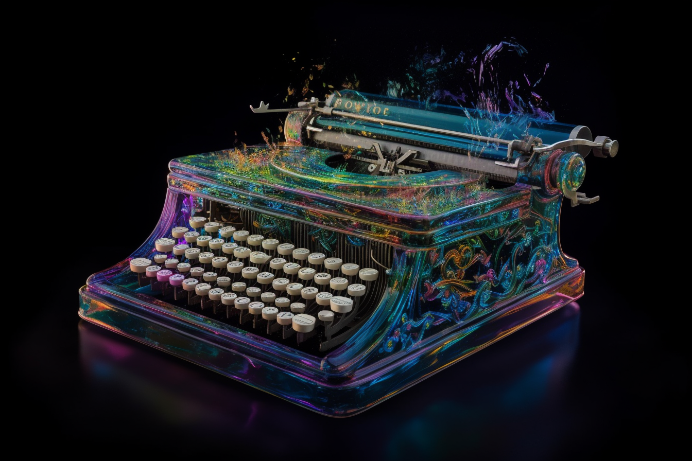
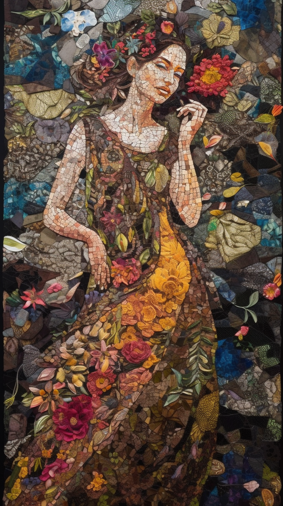
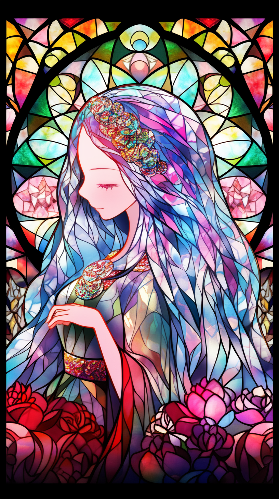

# Generate Prompt for Midjourney by ChatGPT

## 概要
簡単なキーワードをMidjourneyのプロンプト風に出力するChatGPTプロンプトです。

`#Input`で好きなキーワードを指定してください。

* ChatGPT-4を使用しています
* Constrainsts（制約条件）が出力結果に大きな影響を与えます
  * 例えば"Focus on things"を外すと風景の描写が入念になります
* --パラメータは外して生成してもらっています
  * --arや--stylizeの値をChatGPTに最適化させても面白いかもしれません（うまくできるかな...）
* 随時更新します

## プロンプト

```
# Instructions
You are a professional illustrator, skilled at translating illustrations and images into language.
I am planning to paint a picture on the theme of [# Input] Please expand on this theme for detailing.

# Input
Transparent_beautiful_and_colorful_Typewriter

# Constraints
* ending a sentence with a noun or noun phrase
* express it as a single sentence.
* Use your imagination.
* Scenery and descriptions that do not exist in reality are acceptable
* Focus on things
* Please refer to the Example
* The words after "--" should be excluded from the output

# Example
* a person in a boat is floating in the ocean with flowers and stars, in the style of anime, photo-realistic techniques, enchanting lighting, animated gifs, festive atmosphere, gorecore, light emerald and yellow, light emerald and red --version 5 --ar 9:16
* anime girl, angel, cloak streetwear, ritual, japanese logo, 3d, render --ar 9:20 --v 5 --q 2 --stylize 750
* the woman in black and red hat is held out, in the style of pop art prints, art deco elegance, light gray and light black, minimalist pop, flickr, pop art prints, art deco-inspired --v 5 --s 500 --ar 9:16 --chaos 8
* a silver cat in a helmet and headphones, in the style of oliver wetter, steampunk-inspired designs, tilt-shift photography, angus mckie, i can't believe how beautiful this is, afrofuturism-inspired, mechanized precision --ar 56:75 --v 5

# Output
Subject, Description, Style, Graphics, Quality
```

## 出力結果
```
A transparent, ethereal typewriter with vibrant, iridescent keys, in the style of surrealist paintings, floating through a dreamscape filled with luminous ink swirls, cosmic patterns, and translucent quills.
```

## 生成した画像

実際のプロンプトは出力結果にパラメータを追加しています。
```
A transparent, ethereal typewriter with vibrant, iridescent keys, in the style of surrealist paintings, floating through a dreamscape filled with luminous ink swirls, cosmic patterns, and translucent quills --ar 3:2  --v 5
```




## その他例
### コラージュ風女性

```
# Input
Realistic and colorful collage in the shape of a woman
```

```
A striking mosaic of vivid, lifelike elements meticulously arranged to form the silhouette of a woman, adorned with a tapestry of flora and fauna, cultural symbols, and intricate patterns, in the style of contemporary realism.
```




### 女性、カラフル、ガラス製
このように雑なキーワードでも可

```
#input
woman,colorful,made in glass
```

```
A captivating woman crafted from radiant, multicolored glass, reflecting a kaleidoscope of light and shimmering hues, in the style of modern stained glass artistry.
```


